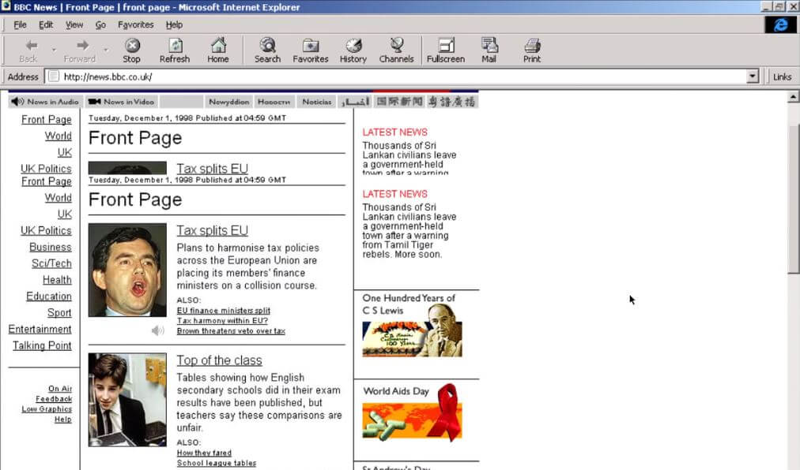

# Ako sa tvorí JavaScript
Tento rok nám frajeri z TC-39 (ak nevieš čo TC-39 je, čítaj ďalej) naservírujú novú verziu ECMAScript špecifikácie - novinky, ktoré môžeme ako vývojári používať pri programovaní v JavaScript-e. `BigInt`, optional chaining, `Promise.allSettled`, `String.matchAll`, `globalThis` a iné.

O tom, aké problémy riešia tieto nové funkcionality si povieme v ďalšom blogu. Tento text je venovaný špecifikácii ECMAScript a okrem iného sa dočítaš:
- prečo potrebujeme špecifikáciu to na to, ako implementovať JavaScript Engine v prehliadači
- prečo sa špecifikácia nevolá JavaScript, ale ECMAScript a čo je to vlastne tá ECMA
- ako dlho trvá, kým sa nápad novej funkcionality jazyka JavaScript stane jeho súčasťou

# ECMAScript?

V roku 1995 vyhrával oscary Tom Hanks s filmom Forest Gump, v rádiách fičal Gansta's Paradise od Coolia a web BBC vypadal takto:



80% používateľov internetu surfovalo v prehliadači Netscape Navigator a Microsoft ešte len končil vývoj Internet Explorer-a. Ak ho vôbec niekedy dokončili.

Nie všetci boli spokojní s tým, ako web vtedy fungoval: statický obsah, zdieľanie dokumentov a žiadny pohyb. Softvérový inžinier z Netscape - Mark Andreessen - chcel vytvoriť jazyk, ktorý by s ľahkosťou používali nielen vývojári, ale aj dizajnéri a do webov priniesli štipku interaktivity. Buttony a tak.

Brendan Eich (meno si treba zapamätať - je to frajer) je človek, ktorý tento programovací jazyk začal tvoriť. Prvým pokusom bola implementácia jazyka SCHEME do prehliadača Netscape.

Mimochodom - javisti v SUN Microsystems premýšľali nad spôsobom, ako spúšťať Java kód v prehliadači, čím tiež priniesli interaktivitu do webových stránok. Táto implementácia však nebola jednoduchá na používanie a preto ostala voľbou korporátnych mastičov. Mocha (takto sa volala prvá verzia dnešného JavaScriptu) bola vytvorená ako alternatíva pre dizajnérov a vývojárov.

## Mocha » LiveScript » JavaScript vs JScript

Vytvorenie prvej verzie Mocha trvalo len 10 dní. Neskôr bol tento jazyk premenovaný na LiveScript a potom na finálny JavaScript. Fun fact: slovo "Java" sa tam nedostalo náhodou - bol to však len marketingový spôsob ako sa zviesť na popularite jazyka Java.

Internet Explorer chcel tiež držať krok s dobou a preto začali aj v MS pracovať na implementácii čohosi, čo bolo veľmi podobné JavaScriptu. Finálny jazyk sa volal JScript. Implementácia však bola natoľko odlišná od JavaScript-u, že tieto implementácie neboli navzájom kompatibilné! Výsledkom bola skutočnosť, že nebolo možné vytvoriť jeden web, ktorý by fungoval v oboch prehliadačoch.

Tak vznikli slávne nálepky do footerov: "Best viewed in Internet Explorer" a "Best viewed in Netscape Navigator".

Tvoriť weby v tej dobe nebola žiadna sranda, vývojári volali po štandarde, ktorý zjednotí implementácie JavaScriptu a JScriptu. Preto bol vytvorený štandard ECMAScript, ktorý zastrešila organizácia ECMA International. Tá fungovala už dávno predtým a jej úlohou bolo práve vytvárať štandardy pre informačné a komunikačné systémy.  Od novembra 1996 existuje teda štandard ECMAScript, ktorý popisuje, ako má byť implementovaný JavaScript Engine.

Fun fact: štandard nemôže niesť ikonický názov  JavaScript, pretože na toto slovo až do dnešného dňa vlastní copyright firma Oracle.

## ECMA-262 a TC-39 - whaaat?

ECMA International zastrešuje veľa štandardov, ten, ktorý sa týka implementácii JavaScriptu dostal číslo 262. ECMA-262 je teda názov štandardu, ktorý opisuje implementáciu JavaScriptu. Nie je to žiadne príjemné čítanie, [aha](https://www.ecma-international.org/ecma-262/10.0/index.html "Štandard ECMA-262").

Komisia (rozumej: živé bytosti, ľudia), ktorá rozhoduje o tom, aké nové funkcie bude nová verzia JavaScriptu obsahovať, dostala zase názov TC-39. Členom tejto komisie nie je hocikto. Sú to [frajeri](https://github.com/orgs/tc39/people?page=1 "Členovia komisie TC-39") - vybraní ľudia, ktorí zastupujú veľké firmy pôsobiace na online trhu (Facebook, PayPal, Google, Amazon, Mozilla...)

## Nová funkcionalita v JS - schvaľovací proces

Členovia TC-39 organizujú meetingy (väčšinou online) každé dva mesiace. Cieľom týchto meetingov je dopodrobna rozkecať a zanalyzovať ktoré funkcie bude obsahovať nová verzia ECMAScript, alebo aké opravy budú v tejto verzii vykonané. Zaujímavé je, že táto komisia funguje na princípe zhody - takmer všetci členovia komisie musia súhlasiť s návrhom, aby sa ním čo i len začali zaoberať.

Celkom zaujímavé je napríklad sledovať, ako sa dostala do JavaScript-u podpora pre `BigInt` - brutálne veľké čísla. Lebo v JavaScripte sme doteraz mohli používať len strašne veľké čísla. 

### Stage 0
Každý návrh začína na takzvanej nultej úrovni - Stage 0. Niektorý z členov TC-39 vytvorí [dokument](https://github.com/tc39/proposal-bigint/commit/c05ae7ee18542770637ae954ece4fc2e764a6101), ktorý popisuje danú funkcionalitu a aký problém rieši. Na meetingu členov TC-39 tento problém prednesie a členovia rozhodli, že napr. `BigInt` je super vec a posunuli ho do ďalšieho Stage-u.

### Stage 1
Stage 1 je parádny úspech a zároveň to znamená, že niekedy v budúcnosti bude pravdepodobne daná funkcionalita súčasťou JavaScriptu. Všetkým (alebo takmer všetkým) členom TC-39 sa tento nápad páči a súhlasia s ním. Môže to však trvať roky. `BigInt` funkcionalita musí byť ešte podrobnejšie popísaná, musí obsahovať príklady ako sa bude používať a analýzu, či to neprinesie aj nejaké problémy.

### Stage 2
Takzvaný Draft. V tejto fáze je viac menej isté, že funkcionalita bude súčasťou JavaScript-u a preto musí byť ešte podrobnejšie popísaná. Toto je tiež stage, kedy sa premýšľa nad vhodnou syntaxou a rôznymi detailami používania novej funkcionality. V prípade `BigInt` funkcionality napr. členovia rozhodli, že bude vhodné, ak BigInt číslo bude obsahovať na konci znak `n` - aby prehliadač (engine) vedel, že pracuje s brutálne veľkým číslom, a nie len strašne veľkým číslom. 

```javascript
const bigIntCislo   = 12345n;
const obycajneCislo = 12345;
```

### Stage 3
Funkcionalita je takmer hotová a potrebuje feedback od vývojárov a vonkajšieho sveta. Všetci testujú `BigInt` vo svojich programoch. Tvorcovia internetových prehliadačov sa predbiehajú, kto z nich bude podporovať `BigInt` ako prvý - pretože implementovať BigInt už má zmysel.

### Stage 4
Všetko je otestované a `BigInt` je súčasťou špecifikácie ECMAScript. Hotovo.

## Záver
Celý proces napr. v prípade `BigInt` trval 2 roky. Viem si predstaviť, že schvaľovanie niektorých ešte komplexnejších funkcionalít môže trvať ešte dlhšie. Frajerom z TC-39 ale môžeme ďakovať za to, že do JavaScriptu sa dostávajú naozaj len veci, ktoré dávajú zmysel.